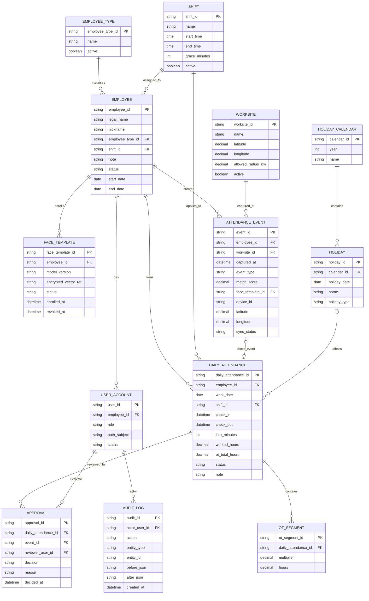

# ดราฟ 4: ER, API และการสแกนใบหน้า — ระบบลงเวลา NOVA

**สถานะ:** เอกสารวิเคราะห์เพื่อทบทวนก่อนปรับซอร์สหรือ deploy ระบบจริง  
**ต่อจาก:** ดราฟ 3  
**สิ่งที่เพิ่ม:** ER, แบบข้อมูล, สัญญา API, สิทธิ์ Admin ขั้นสูง, ปฏิทินวันหยุด และแนวทาง Python สำหรับใบหน้า

## 1. ข้อกำหนดที่รับจากผู้ใช้

- พนักงานใช้งานผ่านมือถือ โดยอุปกรณ์เป้าหมายคือ iPhone 13
- รับการจับคู่ใบหน้าเมื่อเกณฑ์ผ่าน 70% ตามความต้องการเดิม แต่ต้องทดสอบและปรับเกณฑ์กับข้อมูล NOVA ก่อนใช้จริง
- รายการลงเวลาที่ส่งจากพนักงานต้องรอ Admin อนุมัติขั้นสุดท้าย
- มี 3 บทบาท: Admin ขั้นสูง, Admin เพิ่มพนักงาน, User
- Admin ขั้นสูงแก้ไข เพิ่ม และลบ/ปิดใช้งานพนักงานได้
- Admin เพิ่มพนักงานจัดการข้อมูลพนักงานและเพิ่มข้อมูลใบหน้าได้
- ข้อมูลพนักงาน: ชื่อจริง*, ชื่อเล่น*, ประเภทพนักงาน*, กะ*, หมายเหตุ
- ข้อมูลลงเวลา: ชื่อพนักงาน, วันที่, เวลาเข้างาน, เวลาออกงาน, สาย, กะ, OT 1.0x, OT 1.5x, OT 2.0x, OT 3.0x, รวมเวลาทำงาน, รวม OT, หมายเหตุ
- กะเช้า 08:00–17:00; กะปกติ 09:00–18:00
- ผ่อนผันสาย 9 นาที; นาทีที่ 10–15 นับสาย 15 นาที; นาทีที่ 16–20 นับสาย 30 นาที
- ตั้งชื่อสถานที่, Latitude, Longitude และ Allowed Radius (KM) ได้
- มีปฏิทินวันหยุดประจำปี
- LINE ส่งสรุปเวลา 06:00 ของวันก่อนหน้า; เช่น วันที่ 02/10 สรุปวันที่ 01/10
- สำรองข้อมูลทุกวันสุดท้ายของเดือน
- แบบอ้างอิงหน้าเว็บใช้แถบนำทางล่าง: ประวัติของฉัน / หน้าหลัก / ตั้งค่า และมีมาสคอต “โกโก้”
- **เบต้า 1 ห้ามเพิ่มหน้าใหม่**: ใช้แท็บ/หน้าที่มีอยู่ แล้วแสดงส่วนตามสิทธิ์ในหน้าเดิม
- แนวสีที่ระบุก่อนหน้า: ชมพูและน้ำตาลเข้ม; ภาพตัวอย่างใช้บอกโครงหน้าและแอนิเมชันเป็นหลัก

## 2. ข้อสรุปเชิงออกแบบ

### 2.1 Google Sheets ไม่ควรเก็บข้อมูลใบหน้าแบบเต็ม

Google Sheets เหมาะกับข้อมูลพนักงาน ตารางกะ สถานที่ วันหยุด เหตุการณ์ลงเวลา ผลอนุมัติ และรายงาน แต่ **Face Descriptor 128 มิติเป็นข้อมูลชีวมิติที่ใช้ระบุตัวบุคคลได้** จึงไม่ควรใส่เป็น JSON ในชีตที่ผู้แก้ชีตจำนวนมากเปิดอ่านหรือดาวน์โหลดได้

ข้อเสนอ:

- Sheets เก็บ `face_template_id`, รุ่นโมเดล, วันลงทะเบียน, สถานะ, ผู้ลงทะเบียน และวันหมดอายุ/เพิกถอน
- เก็บเวกเตอร์เข้ารหัสในที่เก็บจำกัดสิทธิ์ของบริการ Python แยกจากฐานรายงาน
- ไม่เก็บภาพกล้องถาวรเป็นค่าเริ่มต้น; ส่งเฟรมเท่าที่จำเป็นผ่าน HTTPS, ประมวลผล แล้วลบทิ้ง
- ถ้าบริษัทจำเป็นต้องให้ Sheets เป็นที่เก็บหลักทุกชนิด ต้องออกแบบการเข้ารหัสก่อนบันทึก, จำกัดสิทธิ์ไฟล์, แยกคีย์ออกจากชีต และประเมินความเสี่ยงก่อน

การสแกนใบหน้า/ข้อมูลชีวภาพถูกระบุเป็นข้อมูลอ่อนไหวในแหล่งข้อมูล PDPA ของหน่วยงานรัฐ จึงต้องให้ผู้รับผิดชอบ PDPA/ที่ปรึกษากฎหมายตรวจวัตถุประสงค์ ฐานกฎหมาย/ความยินยอม ประกาศความเป็นส่วนตัว ระยะเก็บ ทางเลือกเมื่อไม่ใช้ใบหน้า และกระบวนการใช้สิทธิ ก่อนเก็บใบหน้าจริง [แหล่งอธิบาย PDPA ของ DITP](https://pdpa.ditp.go.th/content/policy), [พระราชบัญญัติคุ้มครองข้อมูลส่วนบุคคล](https://www.parliament.go.th/view/297/%E0%B8%A3%E0%B8%B2%E0%B8%A2%E0%B8%A5%E0%B8%B0%E0%B9%80%E0%B8%AD%E0%B8%B5%E0%B8%A2%E0%B8%94%E0%B8%82%E0%B9%88%E0%B8%B2%E0%B8%A7/%E0%B8%9E%E0%B8%A3%E0%B8%B0%E0%B8%A3%E0%B8%B2%E0%B8%8A%E0%B8%9A%E0%B8%B1%E0%B8%8D%E0%B8%8D%E0%B8%B1%E0%B8%95%E0%B8%B4%E0%B9%81%E0%B8%A5%E0%B8%B0%E0%B8%9B%E0%B8%A3%E0%B8%B0%E0%B8%Aม%E0%B8วลกฎห%E0%B8ม%E0%B8าย/13/TH-TH)

### 2.2 Python ทำอะไรได้

Python ใช้เป็นบริการ Face API สำหรับตรวจคุณภาพภาพ, ตรวจหลายหน้า/หน้าเดียว, จัดแนวใบหน้า, สร้าง embedding, เทียบเวกเตอร์, ตรวจ liveness/PAD ตามความสามารถของโมเดล และส่งผลที่เซ็นรับรองให้ Apps Script บันทึกได้

Python **ไม่ทำให้ความแม่นยำเพิ่มเองเพียงเพราะเก็บตัวอย่างมากขึ้น** ความแม่นยำขึ้นกับโมเดลที่มีสิทธิ์ใช้, การลงทะเบียนที่มีคุณภาพ, กล้อง/แสง/ท่าทาง, threshold ที่สอบเทียบ, การป้องกันภาพ/วิดีโอปลอม และการทดสอบในสภาพใช้งานจริง

Google MediaPipe มี Face Landmarker สำหรับภาพ วิดีโอ และ live stream แต่เป็นเครื่องมือตรวจ landmark/ใบหน้า ไม่ใช่ตัวจับคู่ตัวตนด้วยเวกเตอร์ 128D โดยตรง [MediaPipe Face Landmarker Python](https://developers.google.com/edge/mediapipe/solutions/vision/face_landmarker/python). โมเดล InsightFace สาธารณะมีข้อจำกัด non-commercial research สำหรับ pretrained weights; ห้ามหยิบมาใช้กับธุรกิจ NOVA ก่อนตรวจ/ได้สิทธิ์เชิงพาณิชย์ [เงื่อนไข model zoo](https://github.com/deepinsight/insightface/blob/master/python-package/docs/model_zoo.md).

NIST ระบุว่าคุณภาพภาพมีผลต่อ false negative และผลต่างประสิทธิภาพระหว่างกลุ่มประชากรแตกต่างได้ จึงควรวัด false accept/false reject จากตัวอย่างและสภาพแวดล้อมจริงของ NOVA ไม่ใช้เลข “70%” ข้ามรุ่นโมเดลโดยตรง [NIST FRTE Demographic Effects](https://pages.nist.gov/frvt/html/frvt_demographics.html). การตรวจ PAD/liveness เป็นส่วนหนึ่งของระบบความเสี่ยง ไม่ใช่แค่ขยับหน้า/กระพริบตาแล้วรับรองว่าปลอมไม่ได้ [NIST FRVT PAD](https://pages.nist.gov/frvt/api/FRVT_pad_api_v1.1.pdf).

## 3. ER Diagram



### คีย์และข้อบังคับสำคัญ

- `employee_id`, `event_id`, `daily_attendance_id`, `approval_id` เป็นรหัสคงที่ ไม่ใช้เลขแถวเป็นคีย์
- กันซ้ำที่ API ด้วย `idempotency_key`; ห้ามพึ่งปุ่ม disable ฝั่งเว็บอย่างเดียว
- หนึ่งคนมีได้หลาย event ต่อวันในฐานข้อมูลดิบ เพื่อรองรับแก้ไข/สแกนซ้ำ; กติกาว่า event ใดจะเป็นเวลาเข้าหรือออกที่รับรองให้เป็นสิทธิ์ Admin
- สรุปต่อวันมี unique key `(employee_id, work_date, shift_id)`; ถ้ารองรับ split shift ให้ปรับเป็น `(employee_id, work_date, shift_id, segment_no)`
- การแก้หรือลบพนักงานต้องทำ soft delete/status และบันทึก Audit Log ไม่ลบประวัติลงเวลาเดิม
- OT เก็บเป็นหลายแถวตามตัวคูณ ไม่เก็บแค่ข้อความรวม เพื่อคำนวณ/ตรวจสอบได้

## 4. Mapping ไป Google Sheets

Apps Script ใช้ `employee_id` และ ID ต่าง ๆ เป็น foreign key เชิงตรรกะ เพราะ Sheets ไม่มี foreign-key constraint; API ต้องตรวจความสัมพันธ์ก่อนเขียน

| Sheet | คอลัมน์หลัก |
|---|---|
| `Employees` | employee_id, legal_name, nickname, employee_type_id, shift_id, department, note, status, start_date, end_date |
| `EmployeeTypes` | employee_type_id, name, active |
| `UserAccounts` | user_id, employee_id, role, auth_subject, status — ห้ามเก็บรหัสผ่านเปล่า |
| `FaceTemplateIndex` | face_template_id, employee_id, model_version, encrypted_vector_ref, status, enrolled_at, revoked_at |
| `Shifts` | shift_id, name, start_time, end_time, grace_minutes, active |
| `Worksites` | worksite_id, name, latitude, longitude, allowed_radius_km, active |
| `AttendanceEvents` | event_id, idempotency_key, employee_id, worksite_id, captured_at, event_type, score, template_id, device_id, lat, lng, status |
| `DailyAttendance` | employee_id, date, check_in, check_out, late_minutes, shift_id, OT_1_0x_hours, OT_1_5x_hours, OT_2_0x_hours, OT_3_0x_hours, worked_hours, total_ot_hours, status, note |
| `OTSegments` | ot_segment_id, daily_attendance_id, multiplier, hours, source_event_id |
| `Approvals` | approval_id, attendance/event_id, reviewer_user_id, decision, reason, decided_at |
| `HolidayCalendars` | calendar_id, year, name |
| `Holidays` | holiday_id, calendar_id, date, name, holiday_type |
| `AuditLog` | audit_id, actor_user_id, action, entity_type, entity_id, before_json, after_json, created_at |
| `Settings` | key, value, updated_by, updated_at |
| `BackupLog` | backup_id, period_key, created_at, file_id, file_url, status, message |

## 5. API ที่ต้องมี

ทุก API ที่อ่าน/เขียนข้อมูลส่วนบุคคลตรวจ session และ role ที่ฝั่งเซิร์ฟเวอร์ ห้ามเชื่อ `role`, `employee_id`, score หรือเวลาที่ frontend ส่งมาโดยไม่มีการตรวจลายเซ็น/สิทธิ์

| Method / action | ใช้ทำอะไร | สิทธิ์ |
|---|---|---|
| `POST auth.login` | เข้าระบบและคืน session สั้นอายุ | ทุกบทบาท |
| `POST face.enroll` | ลงทะเบียนหลายตัวอย่าง สร้าง template | Admin เพิ่มพนักงานขึ้นไป + ขั้นตอนยืนยันตัวตน/ความยินยอม |
| `POST face.verify` | ตรวจคุณภาพ, PAD, จับคู่ใบหน้า แล้วคืน assertion อายุสั้นที่เซ็นโดย Python | User ที่ login แล้ว |
| `POST attendance.submit` | ตรวจ assertion, nonce, เวลา/วัน/พิกัด/ซ้ำ แล้วสร้าง event + pending approval | User |
| `GET attendance.mine` | ดูประวัติของตนเอง | User |
| `GET attendance.pending` | ดูรายการรออนุมัติ | Admin ขั้นสูง |
| `POST attendance.review` | อนุมัติ/ปฏิเสธ พร้อมเหตุผลและ audit | Admin ขั้นสูง |
| `GET/POST employees` | อ่าน/เพิ่ม/แก้ไขพนักงาน | ดูได้ตาม role; เพิ่มแก้ Admin เพิ่มพนักงานขึ้นไป; ลบ/ปิด Admin ขั้นสูง |
| `GET/POST worksites` | อ่าน/แก้สถานที่/radius | Admin ขั้นสูง |
| `GET/POST shifts` | ตั้งเวลาและกติกากะ | Admin ขั้นสูง |
| `GET/POST holidays` | จัดการปฏิทินวันหยุดประจำปี | Admin ขั้นสูง |
| `GET attendance.export` | สร้าง CSV/XLSX ตามแบบฟอร์ม | Admin ตามสิทธิ์ |
| `POST backup.run` | เรียกสำรองซ้ำ/ย้อนหลัง | Admin ขั้นสูง หรือ Trigger service |

การตอบกลับของการส่งสแกนควรมี `event_id`, `status: pending`, `captured_at_server`, `match_result`, `sync_status`; หน้าเว็บแสดง “ส่งแล้ว รออนุมัติ” เฉพาะเมื่อ API ตอบรับจริง

## 6. Flow สแกนหน้าเข้า/ออก

1. User login ด้วยบัญชีของตน; server คืน session ผูกกับ `employee_id`, role และอายุ session
2. เว็บขอสิทธิ์กล้อง/GPS บน iPhone 13 ผ่าน HTTPS และแสดง privacy notice ก่อนเริ่มกล้อง
3. สร้าง challenge/nonce แบบใช้ครั้งเดียวจาก server; ผูกกับ user, event type, worksite และช่วงเวลาสั้น
4. ตรวจภาพ: ต้องมีใบหน้าเดียว, ขนาด/ความคม/แสง/มุมพอ, ไม่ใส่ mask/แว่นสะท้อนจนเทียบไม่ได้; ถ้าไม่ผ่านให้ขยับกล้องและลองใหม่
5. ส่งภาพ/sequence ที่จำเป็นผ่าน TLS ไป Face API Python; ไม่ส่ง descriptor ไปเก็บใน Local Storage หรือ log
6. Face API สร้าง embedding ด้วยรุ่นโมเดลที่อนุมัติ, เทียบ template ที่ active ของพนักงานคนเดียวนั้น, ตรวจ PAD และคืน signed assertion; ไม่คืน descriptor ให้ client
7. เว็บส่ง assertion + nonce + GPS ไป Apps Script API; Apps Script ตรวจลายเซ็น, nonce ใช้ครั้งเดียว, employee state, worksite radius, event ซ้ำ และเวลา server
8. Apps Script บันทึก raw event เป็น `pending`; แจ้ง User ว่าส่งคำขอแล้ว และ Admin ขั้นสูงเห็นในคิว
9. Admin อนุมัติ/ปฏิเสธ; ระบบบันทึกผู้อนุมัติ เวลา เหตุผล และก่อน/หลังใน AuditLog
10. เมื่ออนุมัติแล้ว aggregate เข้าสรุปรายวัน, คำนวณสาย/ชั่วโมง/OT จาก shift/policy version และใช้สร้างไฟล์รายเดือน
11. หลังออกงานสำเร็จ หน้าเว็บพูด “ขอให้โชคดี”; ไม่ต้องให้พนักงานกด OK เพื่อปิดผล
12. เมื่อไม่มีกิจกรรมสแกนใบหน้าครบ 1 นาที ให้พัก/ปิดกล้องและกลับหน้าเริ่มต้นได้จากทุกแท็บ

## 7. ทำคะแนนให้มีความหมายและแม่นขึ้น

### แยกผลลัพธ์ 3 อย่าง

1. **Face detection/quality:** ภาพมีใบหน้าหรือไม่และภาพพร้อมเทียบหรือไม่
2. **Identity match:** embedding ของภาพกับตัวอย่างพนักงานใกล้กันเพียงใดตาม metric ของโมเดล
3. **Liveness/PAD:** หลักฐานมาจากคนที่อยู่หน้ากล้อง ไม่ใช่ภาพถ่าย/วิดีโอเล่นซ้ำ/หน้าจอ

อย่าเรียก `similarity * 100` ว่า “ความแม่นยำ 70%” เพราะ cosine similarity/distance ไม่ได้แปลว่าความน่าจะเป็น 70% และ scale เปลี่ยนตามโมเดล/preprocessing. สอบเทียบ threshold จากข้อมูลทดลองที่ได้รับอนุญาต โดยกำหนด acceptable false-accept rate ก่อน แล้วรายงาน FAR/FRR, failed-to-acquire, retry rate และ latency แยกกัน

### การลงทะเบียนหลายตัวอย่าง

- จับ 3–5 ตัวอย่างใน session เดียว: มองตรง, หันซ้าย/ขวาเล็กน้อย, สภาพแสงปกติ; ปฏิเสธภาพเบลอ/มืด/หลายคน
- บันทึกหลาย embedding แยก template หรือสร้าง prototype ที่ robust; ไม่เฉลี่ยตัวอย่างที่คุณภาพต่ำ
- เก็บ model/version/preprocessing กับ template ทุกชุด; เมื่อเปลี่ยนรุ่นต้องวางแผน re-enrollment หรือ migration และทดสอบย้อนหลัง
- แสดง fallback ให้ Admin ตรวจ/วิธีสำรองเมื่อ face verification ไม่ผ่าน; ห้ามบังคับให้พนักงานลองซ้ำไม่จำกัด
- เพิ่ม PAD ที่ผ่านการประเมิน และทดสอบ photo, screen replay, video replay, mask และสภาพแสงจริง; การกะพริบตาอย่างเดียวป้องกัน replay ไม่พอ
- ทดสอบกับพนักงานจริงที่ยินยอมและอุปกรณ์ iPhone 13 ที่ใช้งาน, ทำชุดแยก enrollment/evaluation, ป้องกันข้อมูลคนเดียวกันรั่วข้ามชุด และตรวจ error ตามแสง/มุม/แว่น/หน้ากาก/ช่วงอายุที่เหมาะสม
- เก็บเฉพาะข้อมูลที่จำเป็น; เข้ารหัส template, จำกัดสิทธิ์, บันทึกการเปิดอ่าน, กำหนด retention/ลบเมื่อพ้นงานหรือถอนความยินยอมตามนโยบายที่ผ่านตรวจ

## 8. การคิดสาย, ชั่วโมง และ OT

กติกาที่ระบุแล้ว:

- กะเช้าเริ่ม 08:00; กะปกติเริ่ม 09:00
- สาย 0–9 นาที = สาย 0 นาที
- นาทีจริง 10–15 = สายคิด 15 นาที
- นาทีจริง 16–20 = สายคิด 30 นาที

ส่วนที่ต้องกำหนดเพิ่มก่อนเขียนสูตร: นาที 21 ขึ้นไปปัดอย่างไร; เวลาพัก; ข้ามเที่ยงคืน; ทำงานวันหยุด; OT เริ่มนับเมื่อใด; แต่ละตัวคูณใช้ในกรณีใด; ปัดเศษเป็นนาที/15 นาที; เวลาที่ใช้เป็น check-in เมื่อมีหลาย scan; และรอบเดือน 1–สิ้นเดือนหรือ 26–25

ให้เก็บเวลาเข้าออกดิบเป็น timestamp ของ server และคำนวณโดย policy version ที่ระบุในแถว เพื่อไม่ให้แก้สูตรภายหลังเปลี่ยนรายงานย้อนหลังโดยเงียบ ๆ `worked_hours` และ OT เป็นผลคำนวณที่ตรวจย้อนกลับได้ ไม่รับค่าคำนวณจาก browser เป็นแหล่งจริง

## 9. หน้าจอโดยไม่เพิ่มหน้าใหม่ในเบต้า 1

ใช้ navigation ล่าง 3 ส่วนตามภาพ:

- **หน้าหลัก:** User เห็นการสแกน/สถานะของวันนี้; Admin เห็นภาพรวมและคิวรออนุมัติ
- **ประวัติของฉัน:** User เห็นเฉพาะประวัติตนเอง; Admin เห็นรายงาน/ตัวกรองตามสิทธิ์เมื่อจำเป็น
- **ตั้งค่า:** User เห็นบัญชี; Admin เพิ่มพนักงาน, ข้อมูลพื้นฐาน, ตั้งกะ/สถานที่/วันหยุด และส่วนจัดการใบหน้าเป็น section ภายในแท็บนี้ ไม่เพิ่ม tab/page ใหม่ใน beta 1

ส่วน Admin เพิ่มพนักงานต้องมีชื่อจริง*, ชื่อเล่น*, ประเภทพนักงาน*, กะ*, หมายเหตุ และ section ลงทะเบียนใบหน้า/Face Descriptor (128D JSON) ที่แสดงสถานะ/รุ่นโมเดลเท่านั้น; ไม่แสดงเวกเตอร์ดิบให้ผู้ใช้คัดลอกใน flow ปกติ

Admin ขั้นสูงเพิ่ม/แก้/ปิดใช้งานพนักงาน, ตั้งสถานที่และ annual holiday calendar, อนุมัติรายการ, แก้ข้อมูลลงเวลาพร้อมเหตุผล และดาวน์โหลดรายงานได้ ทุกการแก้ไขต้องสร้าง audit record

## 10. รายงานและการสำรอง

- Daily summary LINE เวลา 06:00 Asia/Bangkok ใช้ช่วงวันที่ปฏิทินก่อนหน้า ไม่ใช่ 24 ชั่วโมงย้อนหลัง; แสดงวันรายงานชัดเจน
- สรุปจำนวนคนที่มีเวลาเข้า/ออกที่อนุมัติแล้ว, ไม่มีรายการ, รายการรออนุมัติ และผิดปกติ
- Backup trigger ตรวจวันสุดท้ายของเดือนและสำเนา Spreadsheet/ข้อมูลสำคัญไป Drive; ป้องกันสำรองซ้ำด้วย `period_key` และบันทึก `BackupLog`
- แยกไฟล์รายงานลงเวลา (เฉพาะข้อมูลที่ต้องส่ง HR) จาก backup raw events และ audit
- สร้าง XLSX/Sheets ตาม template `บันทึกเวลาเข้างาน_NOVA_รายเดือน`; mapping field ต้องเทียบ workbook จริงก่อนพัฒนา
- Apps Script มี quotas; วางแผน batch read/write, lock กัน event ชนกัน, retry และแจ้ง error [Apps Script quotas](https://developers.google.com/apps-script/guides/services/quotas)

## 11. ทางเลือกสถาปัตยกรรม

```text
iPhone 13 / Safari
  ├─ Netlify: UI, แท็บเดิม 3 ส่วน, local pending queue
  ├─ Python Face API (HTTPS; private service): quality, embedding, PAD, matching
  └─ Google Apps Script API (ตรวจ signed assertion + session/role)
       └─ Google Sheets: Employees, AttendanceEvents, DailyAttendance,
          Shifts, Worksites, Holidays, Approvals, AuditLog, BackupLog

Encrypted face templates: restricted biometric store ของ Face API
Google Drive: monthly report exports + backups
```

หากยืนยันว่าจะไม่เพิ่มบริการ backend นอก Apps Script เลย ให้ประเมินว่ารัน Python ในระบบได้จริงหรือไม่; Apps Script รัน JavaScript ไม่ใช่ Python และ Netlify static site ไม่รัน Python server process เอง การย้าย Python ไป Cloud Run/บริการอื่นเพิ่มค่าโฮสต์และภาระดูแล

## 12. ประเด็นที่ต้องยืนยันก่อนลงมือแก้โค้ด

1. รอบลงรายงาน/เงินเดือน: วันที่ 1–สิ้นเดือน หรือ 26–25; backup ยังคงวันสุดท้ายของเดือนตามปฏิทินได้
2. รายการเข้า/ออก: อนุญาตอย่างละกี่ครั้งต่อวัน, scan ซ้ำเลือกเวลาใด, ข้ามกะ/ข้ามคืนอย่างไร
3. สายหลังนาที 20 และสูตรพัก/ชั่วโมงทำงาน/OT 1.0x, 1.5x, 2.0x, 3.0x
4. ประเภทพนักงานมีค่าใดบ้าง และวันหยุดมีวันหยุดบริษัท/นักขัตฤกษ์/วันหยุดรายบุคคลหรือไม่
5. การเก็บใบหน้า: ผู้อนุมัติการลงทะเบียน, ระยะเก็บ, การถอน/ลบ, fallback และผู้รับผิดชอบ PDPA
6. จะโฮสต์ Python Face API ที่ใด; ใครดูแลค่าใช้จ่าย, security, uptime และเลือกโมเดลที่มีสิทธิ์เชิงพาณิชย์
7. Admin login ใช้ Google Workspace, email + MFA หรือวิธีใด; ใครเป็น Admin ขั้นสูงเริ่มต้น
8. รัศมี GPS หน่วย KM และยอมให้ GPS accuracy กว้างสุดเท่าใด
9. ปฏิทินวันหยุดเก็บเป็นปี พ.ศ. หรือ ค.ศ.; ใครเป็นผู้ใส่/อนุมัติ
10. หน้าประวัติ Admin ใช้แท็บ “ประวัติของฉัน” เปลี่ยนเป็นประวัติทั้งหมดตาม role ได้หรือให้ดูในหน้าหลัก/ตั้งค่า

## 13. ลำดับทำงานที่แนะนำ

1. ยืนยันประเด็นข้อ 12 และกติกา OT
2. ทำ ER/headers ใน Spreadsheet และ migration แบบไม่ลบข้อมูล
3. ทำ authentication/session + role checks และ Apps Script API ก่อนเปิด public deployment
4. เลือก face engine ที่ใช้เชิงพาณิชย์ได้และ Python hosting; ทำ enrollment, PAD, matching และ calibration offline
5. เชื่อมหน้าเว็บเดิมทั้งสามแท็บกับ API และ local queue แบบตรวจ server response
6. ทำ approvals, audit, daily aggregate, holiday calendar, export และ backup
7. ทดสอบบน iPhone 13 ด้วยข้อมูลที่ได้รับอนุญาต วัด FAR/FRR/เวลา และ user fallback ก่อนเปิดจริง

## 14. ขอบเขตดราฟนี้

นี่คือแบบวิเคราะห์/ออกแบบ ยังไม่ได้เปลี่ยนระบบเบต้า 1, สร้าง Python service, เพิ่มชีตจริง, enroll ใบหน้า, deploy, หรือใช้ข้อมูลพนักงานจริง
